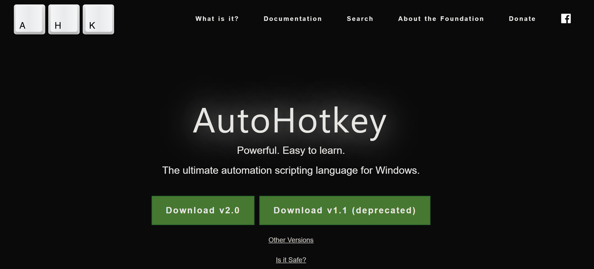
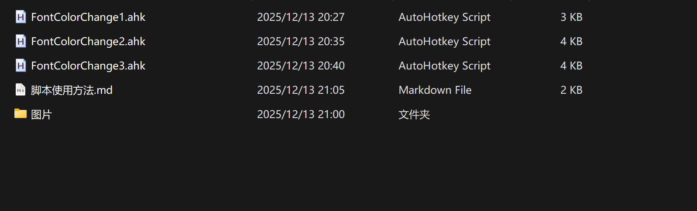
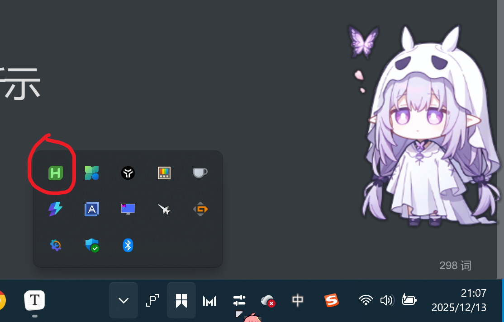
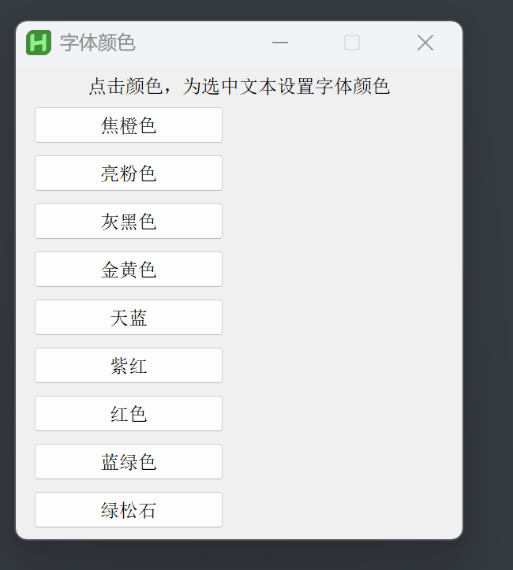
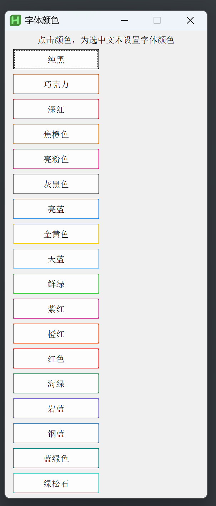
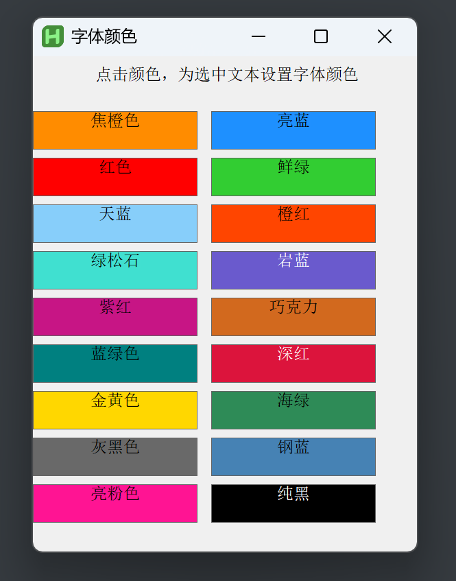
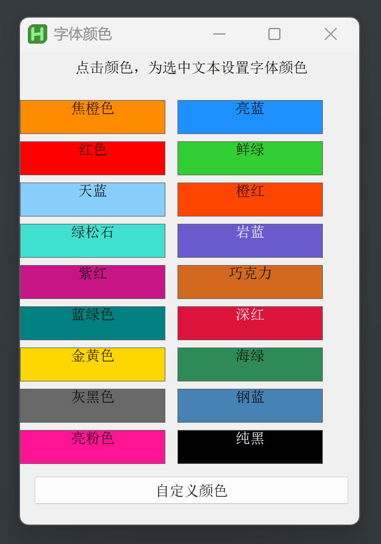
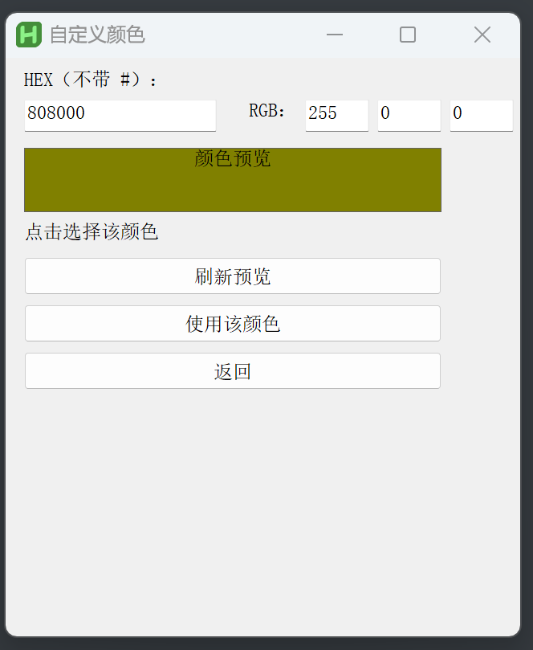

# 大家好呀!

Typora是我最喜欢使用的写作软件,在我使用Markdown文档写游戏开发笔记的时候,遇到一个问题那就是,很多时候我想给字体变一个好看的颜色

我还得在markdown里面一点一点的敲代码比如

我是一个苹果我是红色的

非常难受,而且我是一个懒懒虫,不想动手指

所以我听说存在这样一种东西:那就是Autohotkey,一个可以写自动化脚本的软件

[点击下载Autohotkey](https://www.autohotkey.com/)

## 你们只需要下载那个Autohotkey V2  版本就可以了,那个Autohotkey V1版本有非常多的Bug千万不要用(比如让你的电脑键盘不起作用和让你的电脑死机)

然后使用方法是下载我给你们的脚本(前提是你已经下载了Autohotkey V2)

然后第一步点击其中一个

此时在电脑右下角出现这个东西,绿色的这个,表示脚本已经成功启动啦!

## 然后打开你的Typora(这个脚本只可以在Typora中运行)     在上面随便写一句话并用鼠标左键选中 

##   按下快捷键Ctrl + Alt + C

## 就会弹出一个窗口,然后你可以从中选择颜色哦

比如我选择      “红色”

## 我的脚本分为三代———如下所示

​		第一代:    FontColorChange1.ahk

​		这个非常的简陋,只有单纯的文字,适合喜欢简约风格者

​		

​		第二代:	FontColorChange2.ahk

​		这个添加了简单的颜色和增加了9种颜色,适合喜欢多种颜色者

​			

​		第三代:	FontColorChange3.ahk

​		这个为了让颜色更加直观,每一个选项都添加了颜色,适合所有人

​		

​			第四代:   FontColorChange4.ahk

​				增加自定义颜色的功能,你可以填写你想要的颜色的RBG值或者HEX值来选择颜色

​				

​	

## 未来我可能会再增加一个类似Photoshop的调色盘的功能,毕竟颜色不应该只局限于这18种,希望你们玩得开心哦

​		

​		